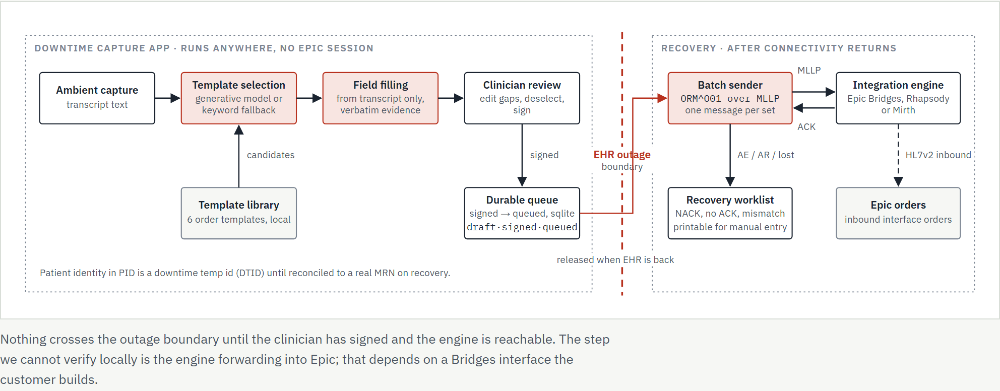
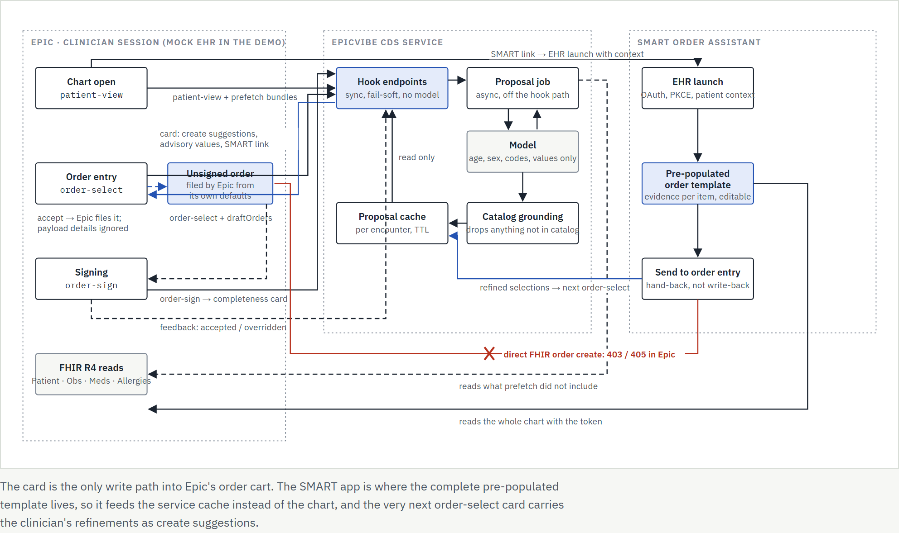

# Demo Walkthrough — Presenter's Script

A live, ~20-minute script for a stakeholder demo covering **both** scenarios. This
complements, but does not duplicate, the detailed runbooks:

- `docs/runbook-demo.md` — full click-through, every setting, all limitations, for
  the mock EHR + downtime demo used here.
- `docs/runbook-reference-sandbox.md` — the Docker-based reference-standards demo
  (HAPI FHIR, SMART App Launcher, CDS Hooks Sandbox), not used in this script.

If a stakeholder asks something this script doesn't answer, the runbook almost
certainly does.

---

## 1. Before you start (5 min)

### Start four processes

No API key needed for any of this — the CDS service runs the `demo` inference
provider (a fixed, catalog-grounded proposal keyed off the patient's problem list)
and the downtime app runs its `fake` keyword extractor. Both are deterministic:
same input, same output, every run.

**PowerShell**

```powershell
$env:EPICVIBE_INFERENCE_PROVIDER = "demo"
python -m uvicorn epicvibe.cds.app:create_app --factory --port 8000      # CDS service      :8000
python -m epicvibe.mockehr                                               # mock EHR         :8100
python -m epicvibe.downtime.mock_engine --port 2575 --inbox .downtime-inbox   # mock HL7 engine  :2575
python -m epicvibe.downtime                                              # downtime app     :8200
```

| Process | Port | What it plays |
|---|---|---|
| CDS service | 8000 | The EpicVibe CDS Hooks service + SMART Order Assistant |
| Mock EHR | 8100 | Stand-in for Epic's chart / ordering UI |
| Mock HL7 engine | 2575 | Stand-in for Epic Bridges/Rhapsody/Mirth |
| Downtime app | 8200 | Standalone capture UI used while the EHR is "down" |

### Pre-flight checklist

- [ ] `http://localhost:8100` shows the **Patients** list with 3 patients (Maria
      Santos, James Okafor, Evelyn Brooks).
- [ ] The top-bar **CDS** badge next to "Refresh CDS" reads `CDS: 3 service(s)` in
      green, not "CDS: unavailable" in red.
- [ ] `http://localhost:8200` shows the red **"EHR OFFLINE — downtime mode"** banner.

If the badge is red, the CDS service (port 8000) isn't reachable from the mock EHR —
check it's actually running before you're in front of anyone.

### What "no API key" really means here

`EPICVIBE_INFERENCE_PROVIDER=demo` and the downtime app's default `provider=fake`
are not stubs that skip a step — they're deterministic, catalog-grounded engines
that stand in for the model. Everything downstream (cards, evidence chips, HL7)
is real; only the "read the chart / read the transcript and propose" step is
non-LLM. Audit rows record this honestly (`fake`, `demo`, or `anthropic:<model>`),
so provenance is never confused with real model output.

### Optional: the Docker reference sandbox

There's a second, heavier demo in `demo/reference-sandbox/` that swaps the in-repo
mock EHR for third-party reference implementations (HAPI FHIR, the SMART App
Launcher, the CDS Hooks Sandbox) via `docker compose up`. It proves spec
conformance against implementations nobody on this project wrote, but it's slower
to bring up and has real limitations of its own (SMART links are dead in the
sandbox UI, Accept doesn't file orders). Don't use it live unless someone
specifically wants to see third-party conformance — use `docs/runbook-reference-sandbox.md`.

---

## 2. The story in one minute

**The problem:** clinicians need help composing safe, catalog-grounded order sets
in two very different situations — one where Epic is up and reachable over CDS
Hooks/SMART, one where it's down entirely.

**Scenario A — offline/downtime:** an ambient transcript becomes a reviewed,
signed order set, and gets written back to Epic later as an HL7v2 `ORM^O01` batch,
once connectivity returns.

**Scenario B — online:** a CDS Hooks card suggests order-set items inside Epic's
native ordering UI; a companion SMART app shows the full pre-populated template
and *hands its edits back* to the CDS service rather than writing anything itself.





**Legend:** solid arrow = verified on our own demo stack; dashed arrow = believed,
from Epic documentation or the write-back spike; red crossed-out line = tested and
confirmed **not possible**.

Full interactive version with all the detail: `diagrams/epicvibe-scenarios.html`.

---

## 3. Scenario B walkthrough (10 min) — Online, mock EHR

**Say:** "This is what a clinician sees while Epic is up. Nothing here writes an
order directly — I'll show you why in a minute."

1. **Do:** Open `http://localhost:8100`. **Say:** "Three synthetic patients, each
   tuned to a different order set." **Do:** Click **James Okafor** (community-acquired
   pneumonia → drives the CAP admission order set).
2. **Show:** Opening the chart fires `patient-view` in the background; after
   about two seconds a **summary card** appears in the CDS Cards tray.
3. **Do:** Go to the **Orders** tab, type an order name (e.g. `ceftriaxone`) into
   the order-name field, and click **Add draft**.
4. **Show:** That fires `order-select`. A **suggestion card** renders with
   pre-populated `create` actions. **Say:** "Point at the developer panel below —
   here's the actual `MedicationRequest` we'd hand Epic: `priority`, `reasonCode`,
   `dosageInstruction` already filled in from the catalog and the chart."
5. **Do:** Click **Accept** on one of the suggestions.
   **Say:** "Accept files the suggestion's resource into the chart as a draft
   order — this is the *only* mechanical write path a CDS suggestion has."
6. **Do:** Click **Sign orders (N)**.
   **Show:** A **completeness card** appears; the drafts flip to `active`.
7. **Do:** Click **Open EpicVibe Order Assistant** on the card (the SMART link).
   **Say:** "This is the fully pre-populated view — the card only ever showed
   you one trimmed resource."
8. **Show:** The SMART app pulls the chart itself and renders every recommended
   item with **evidence chips** quoting what justified it. **Do:** Deselect the
   isolation-precautions item, and edit the ceftriaxone dose from its default up
   to **2 g**.
9. **Do:** Click **Send to order entry**.
   **Say:** "This is the moment that matters. It does *not* write to the EHR —
   it hands the clinician's edited selections back to our CDS service, keyed to
   this encounter."
10. **Do:** Back in the mock EHR's **Orders** tab, click **Re-check suggestions**.
    **Show:** The card that comes back is the *reviewed* one — summary
    "Reviewed in Order Assistant: N selected orders", every item marked
    recommended, the deselected isolation item gone, and the dose shown as
    the clinician's `2 g`, not the original AI value.
11. **Do:** Click **Accept** on the reviewed suggestions, then **Sign orders**.
    **Say:** "Same accept/sign path as before — the edits rode along inside a
    normal CDS Hooks suggestion."

**Talking point — why hand-back, not write-back:** Inside Epic, a SMART app has
*no write channel for orders*. We tested this directly against Epic's sandbox
(`docs/spikes/fhir-order-writeback.md`): an authenticated `POST ServiceRequest`
came back **403**, `POST MedicationRequest` came back **405** — no create exists
in any general context. The only thing that actually files an order is an
**accepted CDS card `create` suggestion**, which Epic turns into an unsigned order
for the clinician to sign. So the SMART app never writes; it hands back, and the
next `order-select`/`order-sign` for that encounter is where the edits actually
surface.

**And Epic ignores order-detail fields in native `create` actions** — it always
resolves our suggestion's code against its own orderable catalog and composes
dose/route/frequency from its own SmartSet/preference-list defaults, not from what
we put in the resource. That's exactly why the SMART app path exists: it's the
only place the fully pre-populated template — and the clinician's edits to it —
is visible end to end.

---

## 4. Scenario A walkthrough (5 min) — Offline/downtime

**Say:** "Now Epic is down. This runs standalone — no EHR connection required
until it's time to write back."

1. **Do:** Open `http://localhost:8200`. Confirm the red **"EHR OFFLINE — downtime
   mode"** banner.
2. **Do:** From the **Load sample…** dropdown, pick `ed-cap-admission`.
3. **Do:** Click **Generate orders**.
   **Show:** The guideline line under the template name (for CAP: *IDSA/ATS 2019
   Diagnosis and Treatment of Adults with Community-acquired Pneumonia*), then the
   three per-field **provenance chips**:
   - **green**, quoting the transcript — the clinician said it; hover to read the quote;
   - **grey "template default"** — nobody said it, it came out of the order set; hover
     for the guideline note behind it;
   - **red "not in transcript"** — a gap, with the input outlined in red.

   **Say:** "Green is the clinician. Grey is the guideline. Red is a hole. None of the
   three is the model inventing a dose."
   **Call out** the red required-missing indicator on any field the transcript didn't
   supply — most visibly, an order with no MRN shown as a minted downtime identifier
   rather than a real one. Point at any deferred/low-confidence order that starts
   **deselected** rather than silently ordered.
4. **Do:** Click **Sign**.
5. **Do:** Click **Preview HL7**.
   **Show:** The `ORM^O01` message. Call out: **MSH** (message header — sending
   app/facility, control id), **PID** (real MRN when known, otherwise a minted
   `DT-xxxxxxxx` temp id with identifier type `DTID`), **ORC** (order control
   `NW`, ordering provider), **OBR** (the order itself — code, priority, reason),
   **RXO** (medications only — dose, units, administration instructions).
6. **Do:** Click **Mark EHR ONLINE** on the banner.
   **Say:** "This just tells the app it's safe to send now — it's a local toggle,
   not a real connectivity check."
7. **Do:** Click **Submit batch to EHR**.
   **Show:** Each queued order gets an **ACK** (`AA`, filed) or **NACK** (`AE`,
   rejected) back over MLLP, one per order. Point at the mock engine's terminal —
   it logs a one-line summary per received message.
8. **Optional recovery demo:** restart the mock engine with
   `python -m epicvibe.downtime.mock_engine --reject-every 2` and submit a batch
   of 3+ orders. **Show:** the NACKed orders land on the **Recovery worklist** —
   a printable list of exactly what did not make it into Epic, so nothing is lost.

---

## 4b. Scenario A, fully offline variant (5 min) — nothing leaves the box

The strongest version of Scenario A is the one you run with the Wi-Fi switched off.
Everything — speech-to-text, the model, the order set, the HL7 — is on the laptop.

### Before the room

One command starts both processes and **warms both models**:

```powershell
.\scripts\start-offline-demo.ps1                 # bash: ./scripts/start-offline-demo.sh
```

It checks the venv and that Ollama has the model (printing the `ollama pull` line if it
does not), starts the mock HL7 engine on `:2575` and the downtime app on `:8200` with
`EPICVIBE_DOWNTIME_OFFLINE_STRICT=true`, then calls `POST /api/warmup` and prints the
offline checklist. It finishes with **"READY — open http://localhost:8200 — you can
disconnect the network now"**. Stop it with `.\scripts\stop-offline-demo.ps1`.

Flags: `-Model` (default `gemma4:26b`), `-WhisperModel` (default `medium`), `-Port`,
`-EnginePort`, `-NoStrict`. Logs land in `.downtime-logs/`.

**Why the warm-up matters.** Both models load lazily — Whisper on the first
transcription, the Ollama weights on the first fill — so without this the *first*
thing you do in front of the room pays for a cold model load: tens of seconds for
Whisper, a minute or more for a 26B model on CPU. The script pays it up front and pins
`EPICVIBE_DOWNTIME_OLLAMA_KEEP_ALIVE=2h`, so the weights stay resident for the whole
session instead of expiring after the default 10 minutes and reloading mid-demo.

Pre-cache the Whisper weights **while you still have internet** — run the script once,
or point `EPICVIBE_DOWNTIME_WHISPER_MODEL_DIR` at a copied model directory.
`GET /api/transcribe/status` reports `model_cached`. See `docs/runbook-demo.md` for the
model-size trade-off and the exact cache path.

<details>
<summary>Manual start (four commands, if you would rather not use the script)</summary>

```bash
export EPICVIBE_DOWNTIME_PROVIDER=ollama          # local weights, not a hosted model
export EPICVIBE_DOWNTIME_OLLAMA_MODEL=...         # whatever `ollama list` shows
export EPICVIBE_DOWNTIME_OFFLINE_STRICT=true      # refuse to start if anything is not local
export EPICVIBE_DOWNTIME_OLLAMA_KEEP_ALIVE=2h     # or the model unloads mid-demo

python -m epicvibe.downtime.mock_engine --port 2575 --inbox .downtime-inbox   # :2575
python -m epicvibe.downtime                                                   # :8200
curl -X POST http://localhost:8200/api/warmup                                 # load both models
```

(PowerShell: `$env:EPICVIBE_DOWNTIME_PROVIDER = "ollama"`, and so on.)

</details>

### Pre-flight (do this in front of them)

1. **Do:** Open `http://localhost:8200/api/offline`.
   **Show:** Four checks, all true — `provider_local`, `whisper_installed`,
   `whisper_model_cached`, `engine_reachable` — and `all_local: true`.
   **Say:** "That is not a promise, it's a check. With `OFFLINE_STRICT=true` the app
   refuses to start at all if any of those is false, and tells you which."
2. **Show:** The **LOCAL ONLY · STRICT** badge in the status bar. Hover it for the
   checklist.
3. **Do:** **Turn off Wi-Fi.** Leave it off for the rest of the scenario.

### The run

1. **Do:** In the transcript panel, pick **Transcribe sample audio…** →
   `ed-cap-admission` (or hit **● Record** and dictate a few lines yourself).
   **Show:** The elapsed timer, then the transcript appearing in the box with model,
   elapsed seconds and segment count. The six samples are multi-speaker — nurse,
   physician and patient each have their own voice — and run 3–4 minutes, so budget
   roughly a minute of CPU for the `medium` model. Pick a shorter run by setting
   `EPICVIBE_DOWNTIME_WHISPER_MODEL=small` if you are demoing on a slow laptop; the
   other five scenarios (CHF, DKA, ACS, sepsis, new T2DM) are in the same menu if the
   room asks for something other than pneumonia.
2. **Do:** Click **Generate orders**.
   **Show:** The chips, as in step 3 above — green quotes, grey template defaults, red
   gaps — with the IDSA/ATS 2019 guideline named under the template.
3. **Do:** Fix anything the transcription got wrong, tick or untick orders, click
   **Sign**, then **Preview HL7**.
4. **Do:** **Mark EHR ONLINE**, then **Submit batch to EHR**.
   **Show:** The ACKs coming back from the mock engine on `localhost:2575` — with the
   network still off.

### The two talking points

- **Whisper mis-hears drug names, and that is the argument, not the objection.**
  On this sample the `small` model hears *ceftriaxone* as "seftriaxone", and even
  `medium` garbles a surname or two. Everything downstream is built for that: the
  transcript is editable, every extracted value is chipped with its evidence, and
  nothing becomes HL7 until a human signs it. A pipeline that hid the
  transcription would be the dangerous one.
- **The grey chips are not model output.** A "template default" is a value a human put
  in the order set, traceable to a named, dated guideline — IDSA/ATS 2019 for this
  template. The model's only job is to fill what the clinician actually said and to
  leave the rest empty; the defaults are applied afterwards, by code, and labelled.

---

## 5. Questions you will get

| Question | Short answer |
|---|---|
| "Is this Epic?" | No — the mock EHR and downtime app are our own harnesses. They model the CDS Hooks/SMART/HL7 contracts closely enough to demo the full loop, but they're not Epic's catalog, BPA presentation, or governance model. The scenario diagrams distinguish what's **verified** on this stack from what's **believed** about Epic's side. |
| "Does the AI compose doses?" | It proposes from the customer's own governance-approved order-set catalog — never invents details. Inside Epic's native ordering UI, Epic still composes the final order from its own SmartSet/preference-list defaults regardless of what we suggest. The SMART app is the one place the fully pre-populated values (and the clinician's edits) are visible end to end. |
| "Where does PHI go?" | Online, no patient identifiers are sent to the model — the `demo`/`fake` providers here aren't models at all, and a real `anthropic` provider run is governed by the same design. Offline, downtime transcripts are gated by `EPICVIBE_DOWNTIME_ALLOW_PHI_TO_MODEL` — off by default, so a live-model downtime run refuses PHI-bearing transcripts unless explicitly enabled. For the strongest answer, run the fully offline variant (§4b): `EPICVIBE_DOWNTIME_OFFLINE_STRICT=true` makes the app refuse to start unless the model, the speech weights and the integration engine are all on-box, and `GET /api/offline` shows the per-item check. |
| "What's needed for real Epic?" | A customer non-production Epic instance, an App Orchard/OPA record for the CDS Hooks + SMART app, JWT verification turned on (it's off by default here for local testing), and — for the downtime path — an actual Bridges/Rhapsody/Mirth inbound ORM interface stood up on the customer's integration engine. See `docs/runbook-demo.md` and `docs/spikes/fhir-order-writeback.md` for the specifics behind each of these. |

---

## 6. Reset between runs

- Mock EHR: click **Reset data** in the top bar — reloads the fixture patients and
  clears the OAuth stub.
- Downtime app: delete its SQLite store (`downtime.db` by default,
  `EPICVIBE_DOWNTIME_DB_PATH`) and restart the app for a clean queue/recovery list.
- Mock HL7 engine: clear (or point `--inbox` at a fresh) inbox directory
  (`.downtime-inbox` by default) between runs so old raw messages don't pile up.
